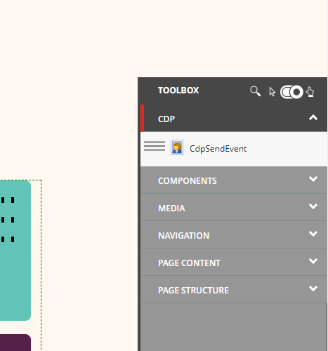
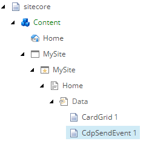
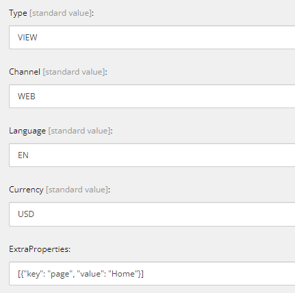
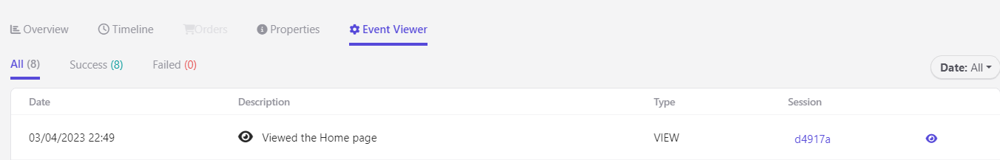
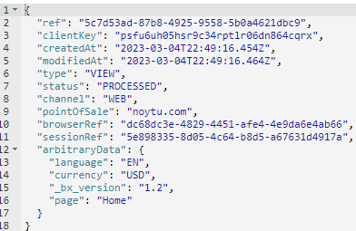

# Sitecore Hackathon 2023
  
# Hackathon Submission Entry form

## Team name
⟹ NOYTU

## Category
⟹ Best enhancement to SXA Headless

## Description
⟹ This module is a generic module that helps to track using Sitecore CDP & Personalize. It can be used to track various types of customer interactions, such as website visits, clicks, form submissions, and more, you can customize it. It provides a flexible and configurable solution for tracking customer interactions, making it easier to collect and analyze customer data.

One of the key benefits of this module is that it is generic, which means that it can be easily customized to fit the specific needs of your business. For example, you can add custom fields to track additional information about your customers, or you can configure the module to track interactions across specific channels or touchpoints.

Overall, the module helps to simplify the process of tracking customer interactions, by providing a generic and configurable solution. It enables businesses to collect and analyze valuable customer data, which can be used to drive marketing, sales, and customer service strategies.

One of the main challenges with Sitecore CDP and Personalize is the lack of a low-code way to integrate and send events to these tools. To address this issue, we have implemented a solution that allows you to add a module with just a few clicks and configure it to send any type of event without requiring any coding.

With this solution, you no longer need to spend time and resources on manual coding to integrate your applications with Sitecore CDP and Personalize. Instead, you can use a simple drag-and-drop interface to add the module and configure it according to your requirements.

This approach not only saves time and effort but also enables more people within your organization to contribute to your data tracking and analysis efforts. By providing a low-code solution, we empower more teams to leverage the power of Sitecore CDP and Personalize, ultimately leading to better customer experiences and increased business outcomes.

## Video link

⟹ [Demo](https://www.loom.com/share/933aeae71eb8494e9a5f211b6a951655)

## Installation instructions

### Sitecore Setup
1. Use the Sitecore 10.3 Installation wizard to install the [Graphical setup package for XM Scaled](https://sitecoredev.azureedge.net/~/media/2062AF6DE2F74F2EBA6A7FA5EEE58578.ashx?date=20221130T155208). Make sure that you install Sitecore Experience Accelerator
2. After completing your installation, we need to use the Sitecore "Installation Wizard" in order to install some packages ([Sitecore Experience Edge Connector](https://sitecoredev.azureedge.net/~/media/D8C6B00FCD21494F9554261741104927.ashx?date=20221102T124433), [Sitecore Headless Services](https://sitecoredev.azureedge.net/~/media/FEC2A2D9E1A3456981673B76FC8C90CA.ashx?date=20221102T124852)).
3. After installing the packages, we need to make some configurations in Sitecore. 
    1. Inside the Content Editor, go to /sitecore/system/Settings/Services/Rendering Hosts/Default and open the file.
    2. In the "Server side rendering engine endpoint URL" field, put: http://localhost:3000/api/editing/render
    3. In the "Server side rendering engine application URL" field, put: http://localhost:3000

### Rendering Setup

1. Go to `/src/MySite`
2. `npm i`
3. `Set ExecutionPolicy Unrestricted`
4. `$env:NODE_TLS_REJECT_UNAUTHORIZED=0` 
5. `jss setup`
6. `jss deploy config`
7. `jss start:connected`

### Content Upload

1. Go to [Content Package](docs/contentPackage/Content.zip)
2. Download the package and install it in sitecore

## Usage instructions

### CDPModule

You can drag and drop this module in any page and in any part of it to track user visits by default. This module is in your toolbox.

After you put this module you can see it created in your content tree

There you can change all the fields in order to send different events or custom attributes

After this is configured, each time a user enters the page where this module is injected, you will track that data in your CDP instance. For this case, we used the partner sandbox instance.

Finally, you can see the data that was sent to the event to validate that is the data from the content in the cms.

